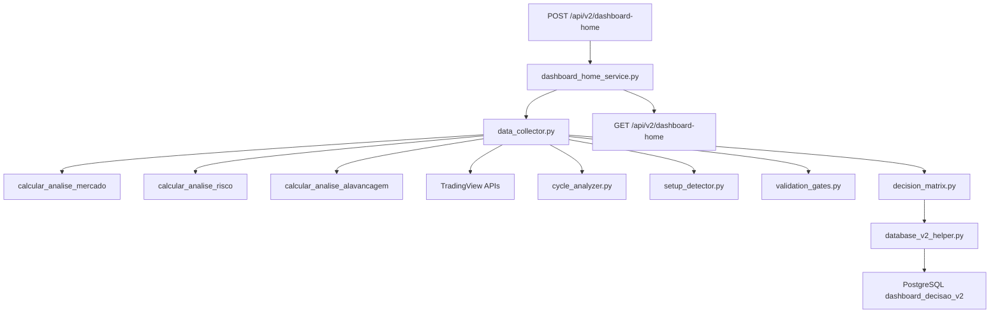

# 📊 Dashboard V2 - Documentação Técnica

## 🎯 Objetivo
Sistema otimizado para tomada de decisão em trading BTC alavancado, consolidando dados de múltiplas APIs em um JSON simplificado.

## 🏗️ Arquitetura



## 📁 Estrutura de Arquivos

### **Router**
- `routers/v2/dashboard_home.py` - Endpoints POST/GET/DEBUG

### **Service Principal**
- `services/v2/dashboard_home_service.py` - Orquestrador principal do fluxo

### **Coletores de Dados**
- `data_collector.py` - **UMA** busca consolidada de todos os dados
- `_get_mercado_data()` - Score mercado + MVRV/NUPL
- `_get_risco_data()` - Score risco + Health Factor  
- `_get_alavancagem_data()` - Limites e margem disponível
- `_get_technical_data()` - EMA144, RSI, preço BTC

### **Processadores de Decisão**
- `cycle_analyzer.py` - Identifica ciclo (BOTTOM → EUFORIA)
- `setup_detector.py` - Detecta setup 4H (PULLBACK, ROMPIMENTO, etc)
- `validation_gates.py` - Gates de proteção (HF, risco, capital)
- `decision_matrix.py` - Matriz final Ciclo × Setup → Ação

### **Banco de Dados**
- `database_v2_helper.py` - CRUD para tabela `dashboard_decisao_v2`

## ⚡ Otimizações Implementadas

### **Eliminação de Redundância**
- **Antes V1:** Score mercado buscado 3x, MVRV 4x, RSI 2x
- **Agora V2:** UMA busca de cada dado

### **Performance**
- **V1:** ~8-12 segundos
- **V2:** ~1.7 segundos (-85% tempo)

### **Reutilização Total**
- APIs existentes mantidas intactas
- TradingView helpers preservados
- Zero alteração em código funcionando

## 🎯 Regras de Negócio

### **Identificação de Ciclo (MVRV-based)**
```python
Score 0-20:   BOTTOM          (3.0x max)
Score 20-40:  ACUMULAÇÃO      (2.5x max)  
Score 40-60:  BULL_INICIAL    (2.5x max)
Score 60-80:  BULL_MADURO     (2.0x max)
Score 80-100: EUFORIA_TOPO    (1.5x max)
```

### **Detecção de Setup 4H**
```python
RSI < 45 + EMA144 ±3%        → PULLBACK_TENDENCIA
Distance ~0% + RSI 30-60     → TESTE_SUPORTE  
Distance > 5% + RSI 45-65    → ROMPIMENTO
RSI < 30                     → OVERSOLD_EXTREMO
RSI > 70 + Distance > 10%    → RESISTENCIA
```

### **Gates de Proteção**
```python
Health Factor < 1.2          → REDUZIR_50-80%
Score Risco < 40             → REDUZIR_50%
Alavancagem >= Permitida     → AJUSTAR_PRIMEIRO
Capital Livre < 5%           → BLOQUEADO
```

### **Matriz de Decisão**
```python
BOTTOM + OVERSOLD_EXTREMO    → COMPRAR 50%
ACUMULAÇÃO + PULLBACK        → COMPRAR 35%  
BULL_INICIAL + ROMPIMENTO    → COMPRAR 20%
BULL_MADURO + RESISTENCIA    → REALIZAR 30%
EUFORIA + QUALQUER_COMPRA    → IGNORAR
```

## 📊 JSON de Saída

```json
{
  "status": "success",
  "data": {
    "header": {
      "status": "pode_aumentar",          // Status operacional
      "btc_price": 105176.47,             // Preço atual BTC
      "alavancagem_atual": 1.86           // Alavancagem atual
    },
    "scores": {
      "mvrv": 2.518,                      // MVRV Z-Score
      "risco": 75.0,                      // Score risco (0-100)
      "mercado": 57.0,                    // Score mercado (0-100)  
      "health_factor": 1.68615            // Health Factor AAVE
    },
    "tecnicos": {
      "rsi_diario": 48.8,                 // RSI diário
      "ema_distance": 10.03,              // Distância % EMA144
      "preco_ema144": 96978.95            // Valor EMA144
    },
    "estrategia": {
      "ciclo": "BULL_INICIAL",            // Ciclo identificado
      "decisao": "COMPRAR",               // Ação recomendada
      "setup_4h": "ROMPIMENTO",           // Setup detectado
      "urgencia": "media",                // Nível urgência
      "justificativa": "Ciclo permite compras com setup favorável. Tamanho: 15%"
    },
    "alavancagem": {
      "atual": 1.86,                      // Alavancagem atual
      "permitida": 2.0,                   // Máximo permitido (MVRV-based)
      "dist_liquidacao": 40.7,            // Distância liquidação %
      "valor_disponivel": 8701.99         // Capital livre disponível
    }
  },
  "metadata": {
    "id": 4,                              // ID registro PostgreSQL
    "created_at": "2025-06-13T18:04:19",  // Timestamp criação
    "age_minutes": 2.18,                   // Idade em minutos
    "versao": "v2_otimizado"              // Versão sistema
  }
}
```

## 🚀 Endpoints

### POST `/api/v2/dashboard-home`
Calcula novo dashboard com dados atuais

### GET `/api/v2/dashboard-home`  
Retorna último dashboard calculado

### GET `/api/v2/dashboard-home/debug`
Informações de debug e arquitetura

## 💾 Banco de Dados

### Tabela `dashboard_decisao_v2`
```sql
- btc_price DECIMAL(10,2)           -- Preço BTC
- score_mercado DECIMAL(5,1)        -- Score mercado
- score_risco DECIMAL(5,1)          -- Score risco  
- ciclo_atual VARCHAR(20)           -- Ciclo identificado
- setup_4h VARCHAR(30)              -- Setup detectado
- decisao_final VARCHAR(30)         -- Decisão final
- alavancagem_atual DECIMAL(3,1)    -- Alavancagem atual
- health_factor DECIMAL(4,2)        -- Health Factor
- ema_distance DECIMAL(6,2)         -- Distância EMA144
- rsi_diario DECIMAL(5,1)           -- RSI diário
- dashboard_json JSONB              -- JSON completo
- created_at TIMESTAMP              -- Timestamp
```

## 🔧 Fluxo de Execução

1. **Coleta Única** - `data_collector.py` busca todos os dados
2. **Processamento** - Analisa ciclo, setup, validações  
3. **Decisão** - Aplica matriz Ciclo × Setup
4. **Persistência** - Salva no PostgreSQL
5. **Resposta** - Retorna JSON estruturado

**Resultado:** Sistema 85% mais rápido, zero redundância, decisões consistentes.