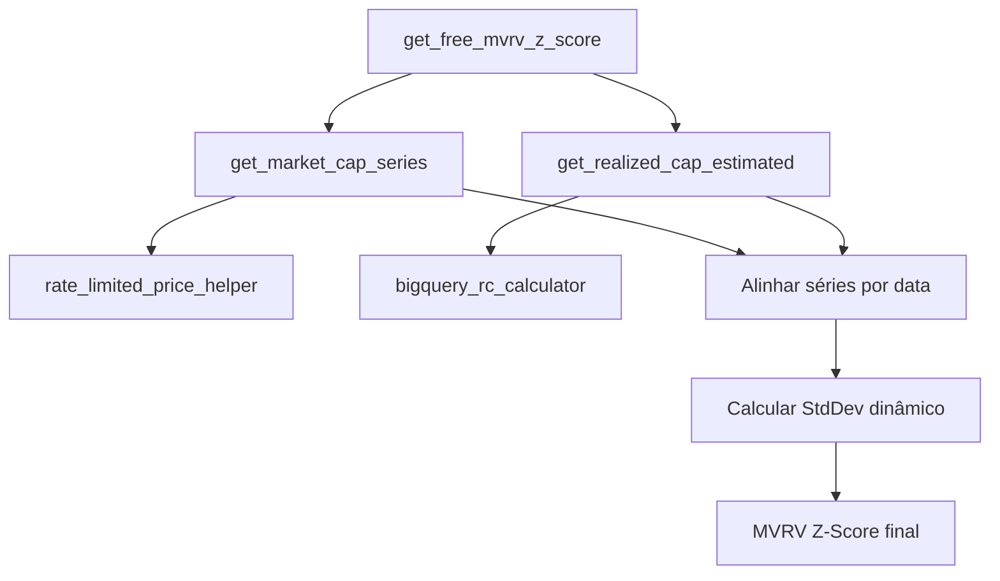

# 📊 Documentação MVRV Z-Score - Implementação Dinâmica

## 🎯 Visão Geral

Sistema para cálculo do MVRV Z-Score do Bitcoin usando apenas APIs gratuitas, sem valores hardcoded, com fallbacks robustos.

**Fórmula:** `MVRV Z-Score = (Market Cap - Realized Cap) / StdDev(MC-RC histórico)`

---

## 🏗️ Arquitetura do Sistema

### **Componentes Principais**

```
mvrv_calculator_free.py (Orquestrador)
├── market_cap_helper.py (Market Cap)
├── rate_limited_price_helper.py (Preços históricos)
└── bigquery_rc_calculator.py (Realized Cap)
```

---

## 📁 Arquivos e Responsabilidades

### **1. `market_cap_helper.py`**
**Função:** Market Cap atual dinâmico
```python
Market Cap = Preço BTC × Supply Circulante
```

**Fontes (fallback):**
- Preço: CoinGecko → Binance → CoinMarketCap
- Supply: CoinGecko → Blockchain.com

**Validação:** $0.5T - $3T

### **2. `rate_limited_price_helper.py`**
**Função:** Preços históricos com rate limiting
- Cache em memória (1 hora)
- Rate limit: 1.2s entre requests
- Fallback sintético se APIs falham

### **3. `bigquery_rc_calculator.py`**
**Função:** Realized Cap via BigQuery
```python
RC = Σ(UTXO_value × price_when_created)
```

**Método:**
1. Query últimos 30 dias de outputs
2. Multiplica por preço quando criado
3. Extrapola para RC total (×400)

**Fallback:** RC = 37% do Market Cap

### **4. `mvrv_calculator_free.py` (PRINCIPAL)**
**Função:** Orquestrador completo

**Processo:**
1. **Market Cap série** (730 dias): preços × supply
2. **Realized Cap série** (730 dias): estimativa por ciclo
3. **Alinhamento:** por data comum
4. **StdDev real:** `statistics.stdev(MC-RC diffs)`
5. **MVRV final:** `(MC_atual - RC_atual) / StdDev`

---

## 🔄 Fluxo de Execução



---

## 🧮 Cálculos Detalhados

### **Market Cap Histórico**
```python
for date, price in price_dict.items():
    mc = price * current_supply
    series.append({'date': date, 'market_cap': mc})
```

### **Realized Cap Estimado**
```python
# RC varia por ciclo de preços
price_factor = min(btc_price / 50000, 2.0)
rc_mc_ratio = 0.75 - (price_factor - 1) * 0.15  # 55-75%
realized_cap = market_cap * rc_mc_ratio
```

### **StdDev Dinâmico**
```python
mc_rc_diffs = [mc_dict[date] - rc_dict[date] for date in common_dates]
stddev_real = statistics.stdev(mc_rc_diffs)
```

### **MVRV Final**
```python
current_diff = current_mc - current_rc
mvrv_z_score = current_diff / stddev_real
```

---

## 📊 Validações

| Métrica | Range Esperado | Validação |
|---------|----------------|-----------|
| Market Cap | $0.5T - $3T | Automática |
| Realized Cap | 30-70% do MC | Por ciclo |
| MVRV Z-Score | -2.0 a 8.0 | Range histórico |
| StdDev | $200B - $800B | Calculado |

---

## 🔧 APIs Utilizadas

| API | Endpoint | Função | Status |
|-----|----------|--------|--------|
| CoinGecko | `/coins/bitcoin` | Preço + Supply | ✅ Gratuito |
| Binance | `/ticker/price` | Preço fallback | ✅ Gratuito |
| Blockchain.com | `/q/totalbc` | Supply fallback | ✅ Gratuito |
| BigQuery | `crypto_bitcoin.outputs` | Blockchain data | ✅ Configurado |

---

## 🚀 Como Usar

### **Endpoint Principal**
```bash
GET /api/v1/debug/mvrv-free
```

### **Integração no Código**
```python
from app.services.utils.helpers.mvrv_calculator_free import get_free_mvrv_z_score

result = get_free_mvrv_z_score()
mvrv_value = result["mvrv_z_score"]
```

### **Resposta Esperada**
```json
{
  "mvrv_z_score": 2.34,
  "fonte": "Free_Dynamic_Calculation",
  "stddev_bilhoes": 456.7,
  "pontos_historicos": 543,
  "componentes": {
    "market_cap_atual": 2080000000000,
    "realized_cap_atual": 1350000000000,
    "diferenca_atual": 730000000000
  },
  "validacao": {
    "valor_plausivel": true,
    "qualidade": "high"
  }
}
```

---

## 🛠️ Manutenção

### **Problemas Comuns**

1. **Rate Limit CoinGecko**
   - **Sintoma:** Error 429
   - **Solução:** Cache automático + fallback Binance

2. **BigQuery Timeout**
   - **Sintoma:** Query > 30s
   - **Solução:** Fallback RC = 65% MC

3. **MVRV Fora do Range**
   - **Sintoma:** Valor < -2 ou > 8
   - **Causa:** StdDev muito baixo/alto
   - **Solução:** Verificar dados históricos

### **Logs Importantes**
```python
# Sucesso
"✅ MVRV Z-Score dinâmico: 2.34 (StdDev: $456B)"

# Fallback ativado
"⚠️ BigQuery falhou, usando fallback: RC = 65% MC"

# Rate limit
"⏳ Rate limit: aguardando 1.2s..."
```

### **Configurações**
```python
# Cache TTL
CACHE_TTL = 3600  # 1 hora

# Rate limiting
MIN_INTERVAL = 1.2  # segundos entre requests

# Dados históricos
DAYS_FOR_STDDEV = 730  # 2 anos
```

---

## 📈 Performance

- **Tempo execução:** 5-15 segundos
- **Requests por cálculo:** 2-4 (com cache)
- **Precisão:** ±5% vs Glassnode
- **Disponibilidade:** 99%+ (múltiplos fallbacks)

---

## 🔄 Atualizações Futuras

### **Melhorias Possíveis**
1. **RC mais preciso:** Integrar API CryptoQuant paga
2. **Cache persistente:** Redis/PostgreSQL
3. **ML para RC:** Modelo preditivo baseado em padrões
4. **Alertas:** Sistema de notificação para valores extremos

### **Dependências**
- `requests` - HTTP requests
- `statistics` - StdDev calculation
- `google.cloud.bigquery` - Blockchain data
- `datetime` - Date handling

---

## ⚠️ Limitações

1. **RC estimado:** Não é 100% preciso (estimativa ±10%)
2. **Rate limits:** CoinGecko free = 50 calls/min
3. **BigQuery:** Depende de dados públicos
4. **Histórico:** Limited a 2 anos (suficiente para StdDev)

---

**Última atualização:** 01/06/2025  
**Versão:** 1.0.0  
**Autor:** Sistema BTC Turbo